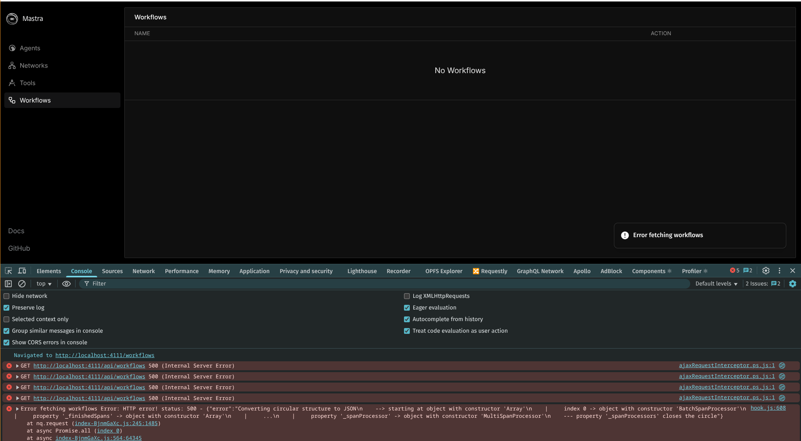

## Nested workflows breaking the UI

The existence of these 2 workflows currently breaks the Mastra UI. There is an error in the console about a circular JSON serialization
issue.

This only happens when a workflow is used as a nested workflow in another workflow AND both are exported from the root mastra instance.

If open the index file and comment out workflow 2 you will observe that the UI starts working again.
